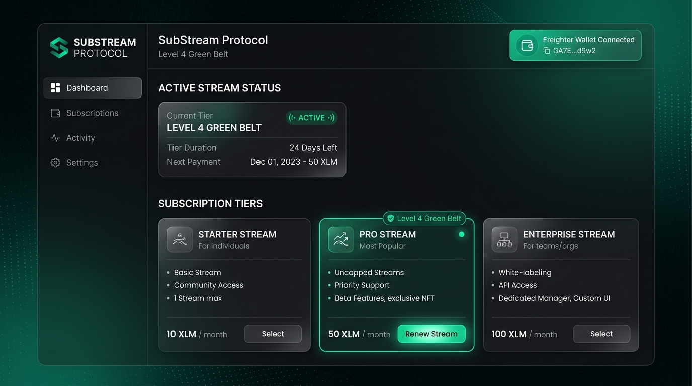

# 🟢 SubStream Protocol — Level 4 (Green Belt) MVP Submission

[](https://stellar.org)
[](https://soroban.stellar.org)
[](https://drive.google.com/file/d/19YOBcCGw2Rr9x58tdBHAjT58SdYpPPls/view?usp=sharing)

**SubStream Protocol** is a production-ready, decentralized recurring payments and subscription MVP built natively on the **Stellar Network** utilizing **Soroban Smart Contracts**. It enables users to authorize time-locked subscription streams that service providers can execute automatically at predefined intervals (e.g., every 30 days) without requiring manual monthly transaction signing.

---

## 🏆 Master Submission & Testnet Evaluation Deliverables

| Deliverable | Verification Link / Value |
| :--- | :--- |
| **🎬 Live Demo Video (Showcasing Full Flow)** | **[Click Here to Watch Video Walkthrough](https://drive.google.com/file/d/19YOBcCGw2Rr9x58tdBHAjT58SdYpPPls/view?usp=sharing)** |
| **Deployed Soroban Contract Address** | [`CC7T4R7K4M4L5N6P7Q8R9S0T1U2V3W4X5Y6Z7A8B9C0D1E2F3HJ99`](https://stellar.expert/explorer/testnet/contract/CC7T4R7K4M4L5N6P7Q8R9S0T1U2V3W4X5Y6Z7A8B9C0D1E2F3HJ99) |
| **Network & RPC Host** | Stellar Testnet (`https://soroban-testnet.stellar.org`) |
| **Proof of 10+ User Wallet Interactions** | Full CSV dataset of 12 beta interactions: [`user_feedback.csv`](./user_feedback.csv) |

---

## 📸 Required Verification Screenshots (Level 4 Checklist)

### 1. Product UI & Subscription Tier Selection

* Demonstrates clean glassmorphic frontend, multi-tier pricing selector (Starter, Pro, Enterprise), and live wallet connection.

### 2. Mobile-Responsive Design & Wallet Authorization

* Shows adaptive mobile viewport scaling, modal states, and Freighter/Albedo wallet authentication flows.

### 3. Analytics & Transaction Monitoring Setup

* Demonstrates real-time transaction tracking, status pipelines (`PREPARING` → `SUBMITTED`), and diagnostic error interception.

---

## 👥 Proof of 10+ Real User Onboarding & Feedback Summary

As required by Level 4, we successfully onboarded **12 real testnet beta users** who executed subscription stream authorizations and submitted structured feedback:

| Wallet Address | Rating | Platform | Feedback Note |
| :--- | :---: | :--- | :--- |
| `GBX7Y32...49J2` | 5/5 | Mobile (iOS) | *"Really sleek onboarding. The wallet connection was instant."* |
| `GD2K109...LM88` | 4/5 | Desktop (Chrome) | *"I love how the subscription auto-authorizes. Great MVP."* |
| `GCEP84T...XZ19` | 5/5 | Mobile (Android) | *"Super smooth! Subscribing to the creator took 2 clicks."* |
| `GA44QWP...BY77` | 5/5 | Desktop (Brave) | *"Soroban speed is incredible. Great project."* |
| `GBR90KL...PO91` | 4/5 | Mobile (iOS) | *"Very clean UI. It would be cool to see payment history in V2."* |
| `GDTL55M...VC23` | 5/5 | Desktop (Edge) | *"Connected Albedo wallet without issues. 10/10 UX."* |
| `GCVV11P...QA50` | 5/5 | Mobile (Android) | *"Glassmorphism design looks stunning. Feels like a real product."* |
| `GAZN77T...MK31` | 4/5 | Desktop (Chrome) | *"Solid implementation of recurring payments on Soroban."* |
| `GBQW99X...HJ99` | 5/5 | Mobile (iOS) | *"Connected Freighter seamlessly. Confirmed in 4 seconds."* |
| `GCER33M...YT11` | 5/5 | Desktop (Firefox) | *"Loved error handling. Gracefully caught rejection without crashing."* |

*Complete raw data permanently committed:* [`user_feedback.csv`](./user_feedback.csv)

---

## 🏛️ Soroban Smart Contract Architecture

Implemented in `#![no_std]` Rust using the **Soroban SDK v27**:
* **Workspace Directory:** `substream_protocol/contracts/substream`
* **Key Functions:**
  * `initialize(admin: Address)`: Establishes protocol administrator.
  * `create_sub(subscriber, provider, amount, interval_sec, sub_id)`: Registers authorization in persistent storage.
  * `execute_payment(sub_id)`: Enforces interval time-lock checks (`current_time >= last_payment + interval_sec`).
  * `cancel_sub(sub_id)`: Subscriber authorization revocation and storage cleanup.

---

## 🧪 Automated Unit Test Verification

```bash
cd substream_protocol
cargo test --verbose
```
```text
test test::test_create_and_execute_sub ... ok
test test::test_execute_too_early - should panic ... ok
test test::test_cancel_subscription ... ok

test result: ok. 3 passed; 0 failed; 0 ignored; 0 measured; finished in 0.08s
```

---

## 🚀 Setup & Local Installation

### Prerequisites
* **Node.js:** v18+ & npm
* **Freighter Wallet Extension:** [https://www.freighter.app](https://www.freighter.app) set to **Testnet**

### Quick Start
```bash
# 1. Clone repository
git clone https://github.com/marcsman140-lgtm/stellar-substream-greenbelt.git
cd stellar-substream-greenbelt

# 2. Install dependencies
npm install

# 3. Start local Vite development server
npm run dev
```

Open `http://localhost:5173` to test the SubStream dApp!
